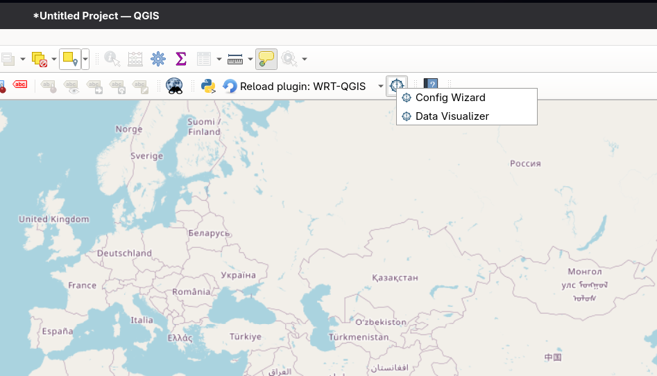
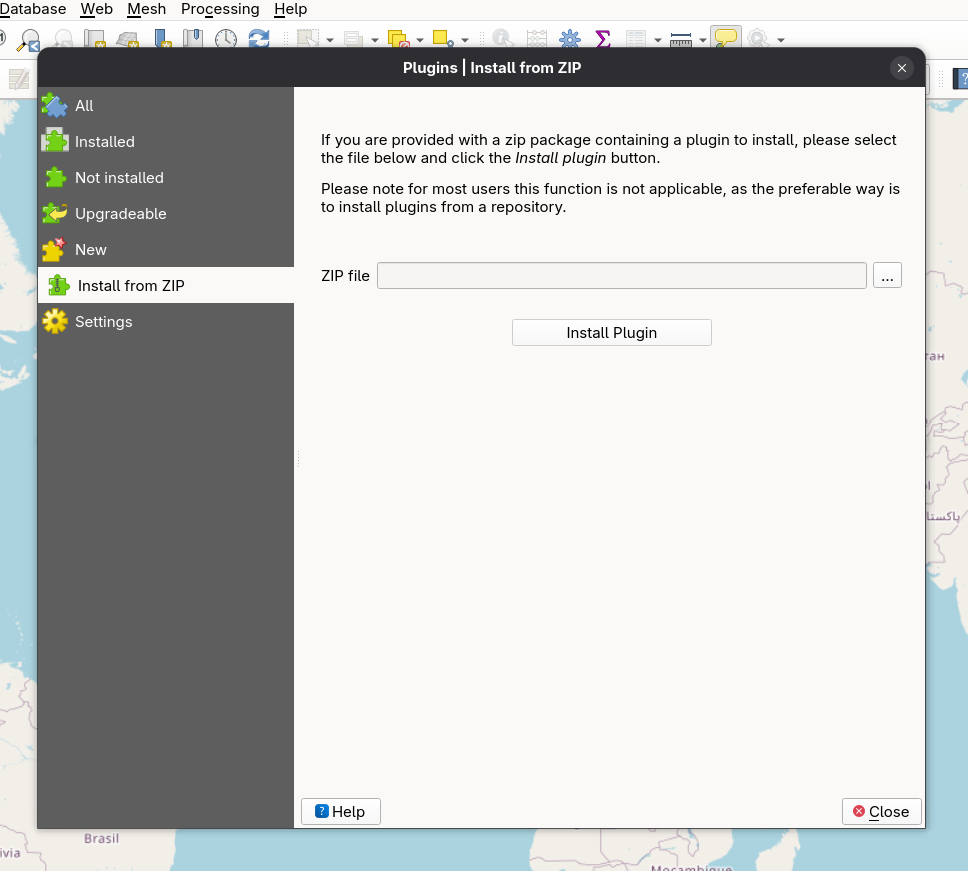
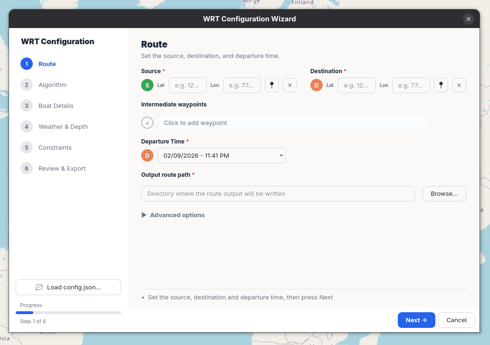
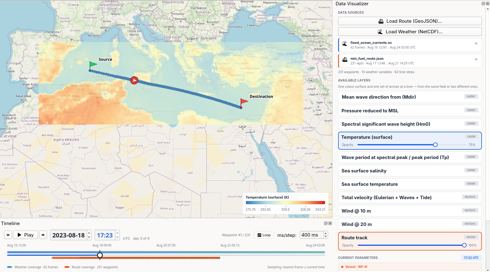

# WRT-QGIS

A QGIS plugin for the [Weather Routing Tool](https://github.com/52North/WeatherRoutingTool) —
plan weather-optimal ship routes and explore the results directly on the map.



## Features

- **Config Wizard** — a step-by-step guide through setting up a routing run:
  route, algorithm, boat, weather, and constraints, with a final review step.
- **Data Visualizer** — a map timeline dock for playing back routes and
  weather data over time, with layer cards, a color legend, histograms, and
  region statistics.

## Requirements

- QGIS 3.44 or newer

## Installation

The plugin can be installed directly from a ZIP archive through the QGIS Plugin Manager.

### 1. Get the plugin ZIP

Download the latest `WRT-QGIS.zip` from the
[releases page](https://github.com/52north/WRT-QGIS/releases).

### 2. Install through the QGIS Plugin Manager

1. Open QGIS.
2. Go to **Plugins → Manage and Install Plugins…**
3. Select the **Install from ZIP** tab.
4. Click the **…** button and browse to the downloaded `WRT-QGIS.zip`.
5. Click **Install Plugin**.
6. Confirm any security warning about installing plugins from a ZIP file.



### 3. Enable the plugin

1. Switch to the **Installed** tab in the Plugin Manager.
2. Make sure **Weather Routing Tool Plugin** is checked (enabled).
3. Close the Plugin Manager. The plugin is now available from the toolbar / **Plugins** menu.

## Updating

To update to a newer version, repeat the **Install from ZIP** steps with the new
ZIP file. QGIS will overwrite the existing installation. Restart QGIS if the
changes do not appear immediately.

## Getting started

### Config Wizard

Open **Plugins → Weather Routing Tool → Config Wizard** to set up a routing
run. The wizard walks through:

1. Route
2. Algorithm
3. Boat Details
4. Weather & Depth
5. Constraints
6. Review & Export



### Data Visualizer

Open **Plugins → Weather Routing Tool → Data Visualizer** to explore a route
alongside its weather data. The visualizer adds a side panel and a timeline
dock at the bottom of the map, letting you scrub through time and inspect
values at each step.



## Preparing weather data

Run this over a NetCDF file before loading it into the plugin — it takes a
second and gives better results.

QGIS's data-pairing layer (MDAL) pairs the two components into a single vector field by
comparing those names exactly, so one extra space is enough to stop it: the file
loads as two separate scalar layers, and the field can never be drawn as arrows.
That pairing is decided while the file is being opened, so the plugin cannot
correct it afterwards.

```bash
python tools/fix_netcdf_names.py data.nc
```

If the file is fine, it says so and writes nothing:

```
data.nc: no issue found
```

Otherwise a repaired copy is written next to it. The input file is never
modified — load the `_fixed` file in the plugin:

```
data.nc: fixed vtotal → wrote data_fixed.nc
```

The script needs the `netCDF4` package (`pip install netCDF4`), and the
repaired copy is a full duplicate of the input.

## Getting help

- Questions and bug reports: [issue tracker](https://github.com/52north/WRT-QGIS/issues)
- Weather Routing Tool docs: [52north.github.io/WeatherRoutingTool](https://52north.github.io/WeatherRoutingTool/)

## Contributing

Looking to contribute code? See [CONTRIBUTING.md](CONTRIBUTING.md) for the
development setup, lint/format commands, and code style guidelines.

## License

See [LICENSE](LICENSE).
